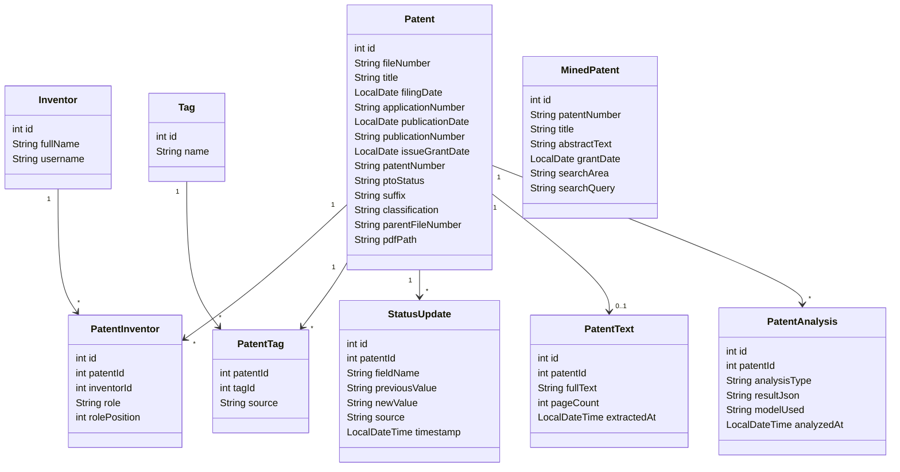
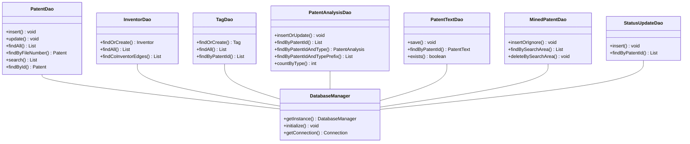

# Class Diagrams

This document provides Mermaid class diagrams for the patent tracking application, organized by architectural layer: domain models, data access, services, and controllers.

## Domain Models

The core domain model centers on the `Patent` entity, which connects to inventors through a join table supporting roles, to tags for classification, and to various content and analysis records. `StatusUpdate` provides an audit trail of changes, while `MinedPatent` captures externally discovered patents from search operations.

## Data Access Layer

The DAO layer follows a singleton `DatabaseManager` pattern. Each DAO encapsulates all SQL operations for its corresponding domain entity. The `DatabaseManager` owns the SQLite connection lifecycle, and every DAO obtains connections through it.

## Service Layer

Services implement the application's business logic. Several services produce typed result records to communicate outcomes back to callers. `ClaudeCliService` integrates with the Claude CLI for AI-powered patent analysis and exposes a `StreamingCallback` interface for real-time output. `InsightService` and `PatentMiningService` orchestrate multi-step workflows that combine AI analysis with data persistence.

```mermaid
classDiagram
    class CsvImportService {
        +importCsv() ImportResult
    }

    class ImportResult {
        int imported
        int updated
        int unchanged
        List errors
    }

    class UsptoSyncService {
        +syncPatent() SyncResult
        +syncAll() SyncResult
    }

    class SyncResult {
    }

    class ClaudeCliService {
        +analyze() AnalysisResult
        +analyzeStreaming() AnalysisResult
        +loadPromptTemplate() String
    }

    class AnalysisResult {
        boolean success
        String resultJson
        String error
        String modelUsed
        long durationMs
        int inputTokens
        int outputTokens
        double costUsd
    }

    class StreamingCallback {
        <<interface>>
    }

    class InsightService {
        +analyzeTechnology() InsightResult
        +analyzeClaims() InsightResult
        +analyzeExpansion() InsightResult
        +analyzePriorArt() InsightResult
        +analyzeWhitespace() InsightResult
        +analyzeClustering() InsightResult
        +analyzeAdjacency() InsightResult
        +analyzeTemporalTrends() InsightResult
        +analyzeClaimCollision() InsightResult
        +analyzeCompetitorGaps() InsightResult
        +analyzeInventionPrompts() InsightResult
        +analyzeCrossDomain() InsightResult
        +exportMarkdown() void
    }

    class InsightResult {
    }

    class CrossPatentProgressCallback {
        <<interface>>
    }

    class PatentMiningService {
        +extractAreasOfInterest() List
        +extractInventionPrompts() List
        +mineArea() MiningResult
        +mineInventionPrompt() MiningResult
        +mineAllInventionPrompts() List
        +getAllMiningResults() List
        +exportAllMiningMarkdown() void
    }

    class MiningResult {
    }

    class MiningHistoryItem {
    }

    class AreaOfInterest {
    }

    class InventionPromptItem {
    }

    class MiningProgressCallback {
        <<interface>>
    }

    class BulkMiningProgressCallback {
        <<interface>>
    }

    class GooglePatentsSearchService {
        +search() SearchResult
    }

    class SearchResult {
    }

    class SearchProgressCallback {
        <<interface>>
    }

    class PdfDownloadService {
        +downloadPdf() void
    }

    class PdfExtractorService {
        +extractText() String
    }

    class GraphDataService {
        +buildGraphJson() String
    }

    class StatsService {
        +getTotalCount() int
        +getStatusBreakdown() Map
        +getYearlyBreakdown() Map
        +getOwnerRoleBreakdown() Map
        +getTopCollaborators() List
    }

    class AutoTagService {
        +autoTag() void
    }

    CsvImportService *-- ImportResult
    ClaudeCliService *-- AnalysisResult
    ClaudeCliService -- StreamingCallback
    InsightService *-- InsightResult
    InsightService -- CrossPatentProgressCallback
    PatentMiningService *-- MiningResult
    PatentMiningService *-- MiningHistoryItem
    PatentMiningService *-- AreaOfInterest
    PatentMiningService *-- InventionPromptItem
    PatentMiningService -- MiningProgressCallback
    PatentMiningService -- BulkMiningProgressCallback
    GooglePatentsSearchService *-- SearchResult
    GooglePatentsSearchService -- SearchProgressCallback
    UsptoSyncService *-- SyncResult

    InsightService -- ClaudeCliService
    InsightService -- PatentAnalysisDao
    InsightService -- PatentTextDao
    InsightService -- PdfExtractorService
    PatentMiningService -- ClaudeCliService
    PatentMiningService -- GooglePatentsSearchService
    PatentMiningService -- PatentAnalysisDao
    PatentMiningService -- MinedPatentDao
    PatentMiningService -- PatentDao
    CsvImportService -- PatentDao
    CsvImportService -- InventorDao
    CsvImportService -- StatusUpdateDao
```

## Controllers

Controllers wire the JavaFX UI to the service layer. `MainController` owns the top-level `TabPane` and coordinates CSV import, USPTO sync, and auto-tagging. Each tab has a dedicated controller that manages its own view lifecycle and user interactions. `SyncController` and `PdfDownloadController` present progress modals for long-running operations.

```mermaid
classDiagram
    class MainController {
        +handleImportCsv() void
        +handleSyncAll() void
        +handleAutoTag() void
    }

    class PatentListController {
        +refreshData() void
        +handleSearch() void
    }

    class PatentDetailController {
        +handleSave() void
        +handleDelete() void
        +handleSync() void
    }

    class DashboardController {
        +refresh() void
    }

    class GraphController {
        +refresh() void
    }

    class InsightsController {
        +handleExtractAll() void
        +handleAnalyzeAll() void
        +handleWhitespace() void
        +handleClustering() void
        +handleExportAll() void
        +refresh() void
    }

    class MiningController {
        +handleMine() void
        +handleMineAllPrompts() void
        +handleExport() void
        +handleExportAll() void
        +loadMiningHistory() void
        +refresh() void
    }

    class SettingsController {
        +handleSave() void
        +getOwnerName() String
        +getClaudeCliPath() String
        +getIdleTimeout() int
        +getBatchSize() int
    }

    class SyncController {
        +startSync() void
    }

    class PdfDownloadController {
        +startDownload() void
    }

    class ClassificationController {
        +handleAdd() void
        +handleDelete() void
    }

    MainController -- CsvImportService
    MainController -- UsptoSyncService
    MainController -- AutoTagService
    PatentListController -- PatentDao
    PatentDetailController -- PatentDao
    DashboardController -- StatsService
    GraphController -- GraphDataService
    InsightsController -- InsightService
    MiningController -- PatentMiningService
    SyncController -- UsptoSyncService
    PdfDownloadController -- PdfDownloadService
```

