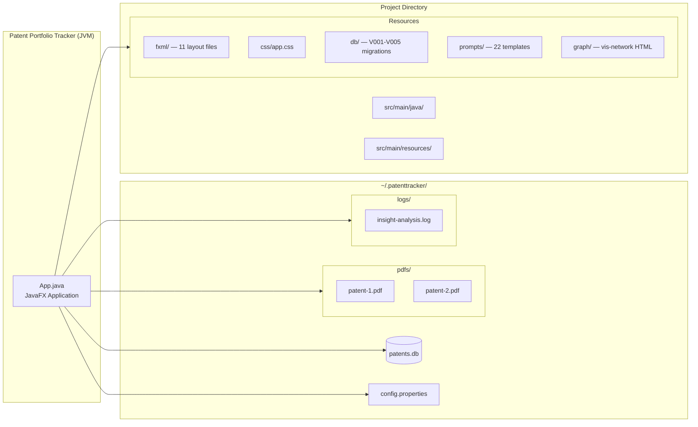

# Architecture Overview

Patent Portfolio Tracker is a desktop application for managing, analyzing, and mining patent portfolios. It combines patent lifecycle management with AI-powered analysis to help patent inventors identify strategic filing opportunities and understand their competitive landscape.

## Technology Stack

| Component | Technology | Purpose |
|-----------|-----------|---------|
| Language | Java 21 (LTS) | Application logic |
| UI Framework | JavaFX 21 (OpenJFX) | Desktop GUI with FXML layouts |
| Database | SQLite 3.45 (sqlite-jdbc) | Local embedded database, WAL mode |
| CSV Parsing | OpenCSV 5.9 | Patent CSV import |
| JSON | Jackson Databind 2.16 | Analysis results, API responses |
| PDF Extraction | Apache PDFBox 3.0 | Full-text extraction from patent PDFs |
| Graph Visualization | vis-network (via WebView) | Inventor collaboration graph |
| AI Integration | Claude CLI (subprocess) | Patent analysis and mining |
| Build | Maven 3.x | Dependency management, packaging |

## System Component Diagram

```mermaid
graph TB
    subgraph UI["UI Layer (JavaFX Controllers + FXML)"]
        MC[MainController<br/>Tab management, menus]
        PLC[PatentListController<br/>Search, filter, table]
        PDC[PatentDetailController<br/>Edit, sync, insights]
        DC[DashboardController<br/>Stats, charts]
        GC[GraphController<br/>Inventor network]
        IC[InsightsController<br/>AI analysis triggers]
        MNC[MiningController<br/>Patent mining UI]
        SC[SettingsController<br/>Configuration]
        SYC[SyncController<br/>USPTO sync progress]
        PDFC[PdfDownloadController<br/>PDF download progress]
        CC[ClassificationController<br/>Tag management]
    end

    subgraph Services["Service Layer"]
        CSV[CsvImportService<br/>CSV parsing, dedup]
        USPTO[UsptoSyncService<br/>USPTO API client]
        IS[InsightService<br/>Chunked map-reduce analysis]
        PMS[PatentMiningService<br/>Area + IP mining]
        CCS[ClaudeCliService<br/>Claude CLI subprocess]
        GPS[GooglePatentsSearchService<br/>Patent search API]
        PDS[PdfDownloadService<br/>PDF retrieval]
        PES[PdfExtractorService<br/>PDFBox text extraction]
        GDS[GraphDataService<br/>Network data builder]
        SS[StatsService<br/>Dashboard queries]
        ATS[AutoTagService<br/>Keyword-based tagging]
    end

    subgraph Data["Data Layer (DAOs)"]
        DM[DatabaseManager<br/>SQLite connection, migrations]
        PD[PatentDao]
        ID[InventorDao]
        TD[TagDao]
        PAD[PatentAnalysisDao]
        PTD[PatentTextDao]
        MPD[MinedPatentDao]
        SUD[StatusUpdateDao]
    end

    subgraph External["External Systems"]
        UAPI[USPTO Open Data Portal<br/>api.uspto.gov]
        GAPI[Google Patents<br/>patents.google.com/xhr]
        CLAUDE[Claude CLI<br/>Subprocess]
        PDFS[(Patent PDFs<br/>patents.google.com)]
    end

    subgraph Storage["Local Storage (~/.patenttracker/)"]
        DB[(patents.db<br/>SQLite)]
        CFG[config.properties]
        CACHE[pdfs/<br/>PDF cache]
        LOGS[logs/<br/>Analysis logs]
    end

    MC --> PLC & DC & GC & IC & MNC
    PLC --> PD
    PDC --> PD & USPTO & IS
    DC --> SS
    GC --> GDS
    IC --> IS
    MNC --> PMS

    CSV --> PD & ID & SUD
    USPTO --> UAPI
    IS --> CCS & PAD & PTD
    PMS --> GPS & CCS & PAD & MPD
    CCS --> CLAUDE
    GPS --> GAPI
    PDS --> PDFS
    PES --> PTD

    PD & ID & TD & PAD & PTD & MPD & SUD --> DM
    DM --> DB
    SC --> CFG
    PDS --> CACHE
    IS --> LOGS
```



## Deployment Layout



## Data Flow

Data enters the system through three paths, gets processed and analyzed, and can be exported:

### Ingestion

1. **CSV Import** — User imports a USPTO patent CSV. The `CsvImportService` parses rows, deduplicates by file number, resolves parent/child relationships (continuations, divisionals), and stores patents with inventor associations.

2. **USPTO Sync** — The `UsptoSyncService` queries the USPTO Open Data Portal API using application numbers to fetch current status, patent numbers, and grant dates. Changes are tracked in a field-level audit log.

3. **PDF Download** — The `PdfDownloadService` downloads patent full-text PDFs from Google Patents and caches them locally. The `PdfExtractorService` then extracts plain text using Apache PDFBox.

### Processing

4. **AI Analysis** — The `InsightService` orchestrates 12 analysis types (4 single-patent, 8 cross-patent). Single-patent analyses run Claude CLI on individual patent text. Cross-patent analyses use a chunked map-reduce pattern: split the portfolio into batches, analyze each batch, then hierarchically merge results.

5. **Patent Mining** — The `PatentMiningService` searches Google Patents for external patents in areas of interest, then runs Claude analysis to generate new patent ideas informed by both the existing portfolio and the competitive landscape. Supports two modes: general area mining and invention prompt validation.

### Output

6. **Dashboard** — Real-time analytics: status breakdown, yearly trends, inventor statistics, classification distribution, top collaborators.

7. **Inventor Graph** — Interactive network visualization of co-inventor relationships with domain coloring and hover-to-focus.

8. **Export** — All analysis and mining results can be exported to Markdown documents for sharing and archival.

## Module Structure

The application uses Java 9+ module system (`module-info.java`):

```
module com.patenttracker {
    requires javafx.controls, javafx.fxml, javafx.web
    requires java.sql, java.net.http, java.desktop, jdk.jsobject
    requires com.opencsv, com.fasterxml.jackson.databind
    requires org.xerial.sqlitejdbc, org.apache.pdfbox
}
```

Packages:
- `com.patenttracker` — Application entry point (`App.java`)
- `com.patenttracker.controller` — 11 JavaFX controllers
- `com.patenttracker.service` — 11 business logic services
- `com.patenttracker.dao` — 8 data access objects
- `com.patenttracker.model` — 9 domain model classes
- `com.patenttracker.util` — 2 parsing utilities

## Related Documentation

- [Class Diagrams](class-diagrams.md) — Detailed class relationships
- [Sequence Diagrams](sequence-diagrams.md) — Key interaction flows
- [User Guide](../user-guide.md) — How to use the application
- [CSV Format](../csv-format.md) — Import file specification
- [Mining Guide](../mining-guide.md) — Patent mining capabilities
- [Portfolio Analysis Guide](../portfolio-analysis-guide.md) — AI analysis types and workflows
