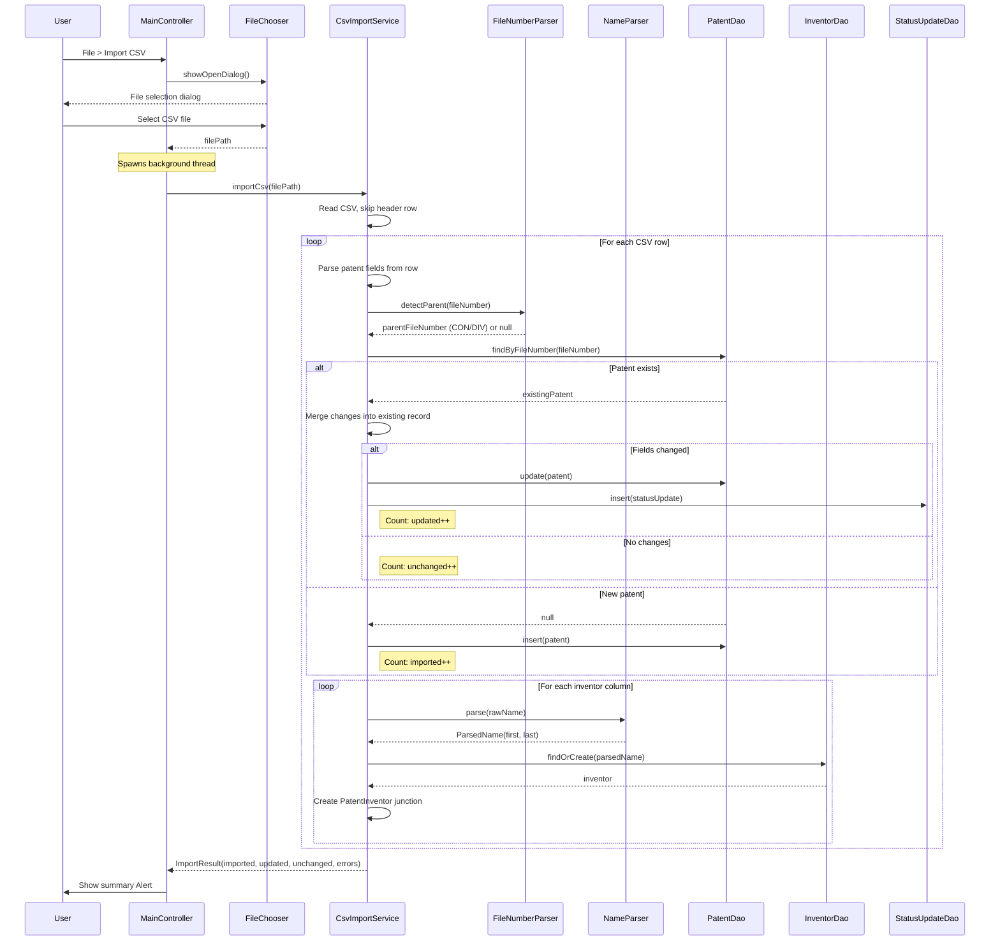
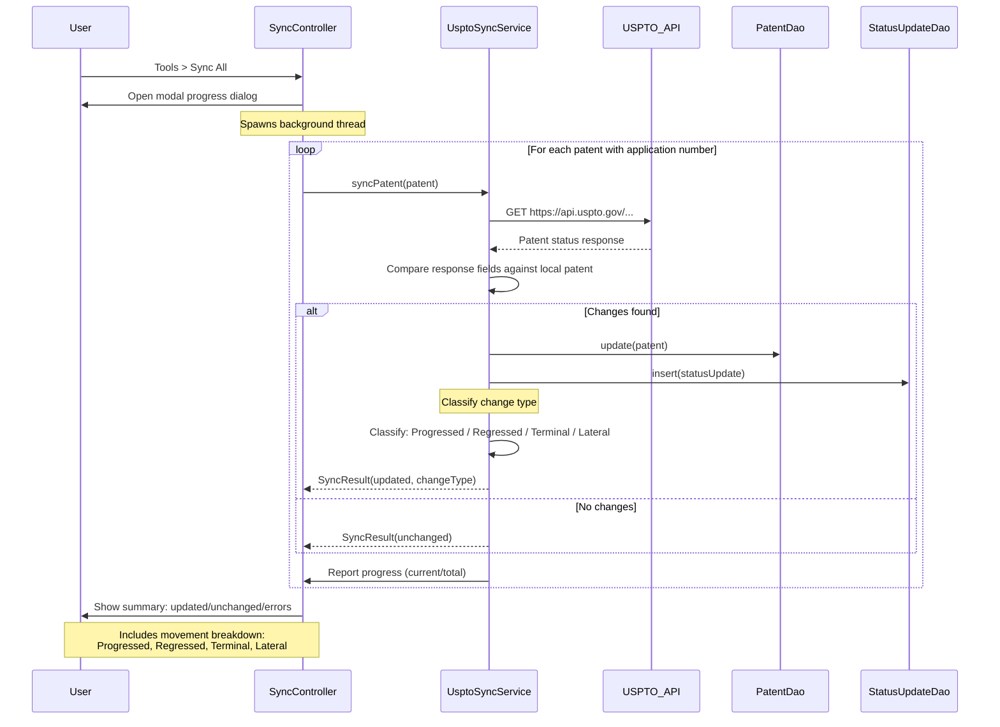
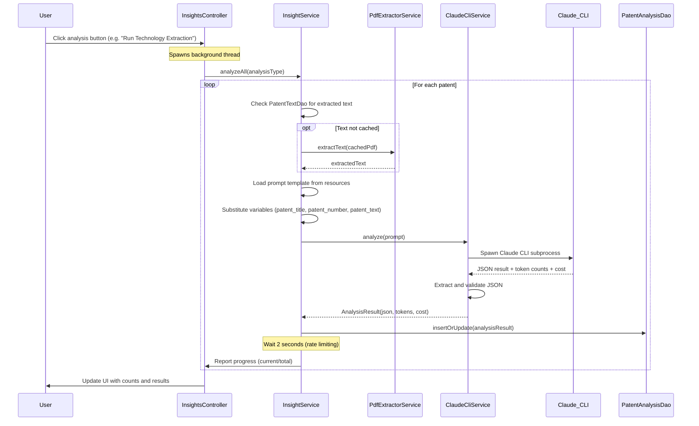
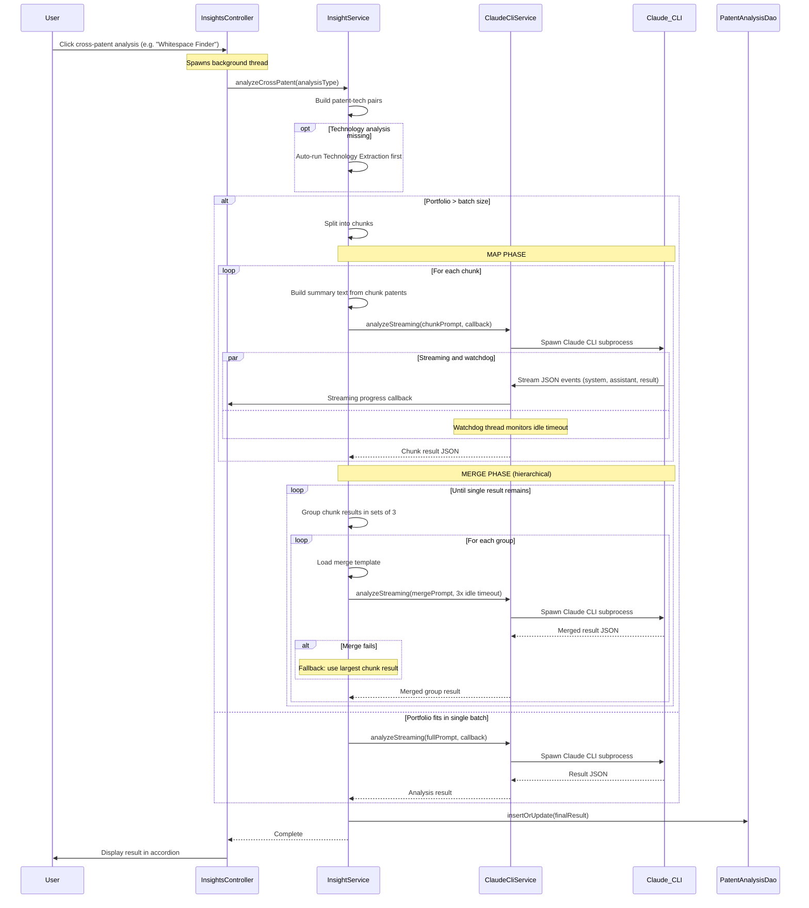
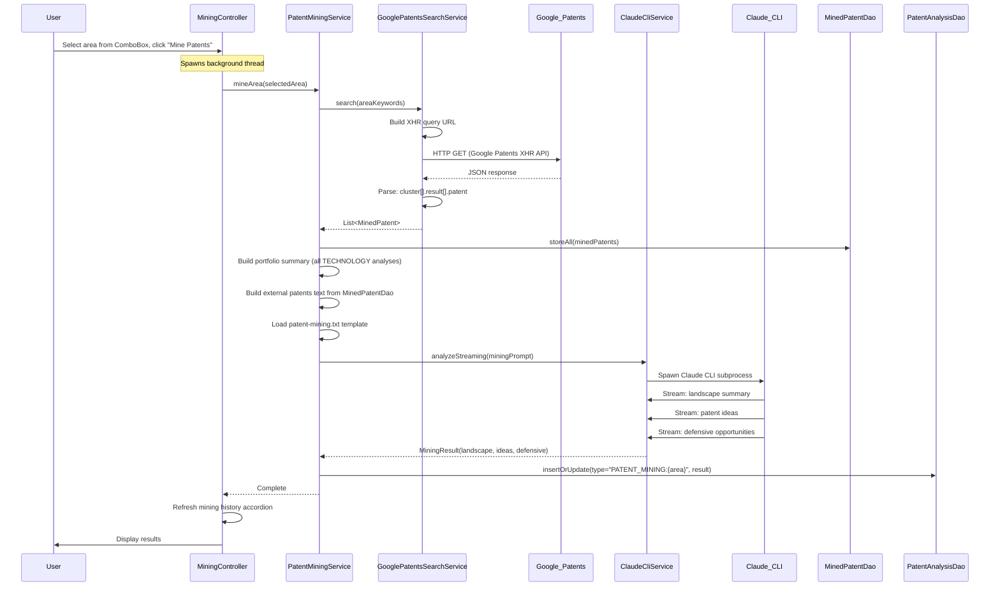
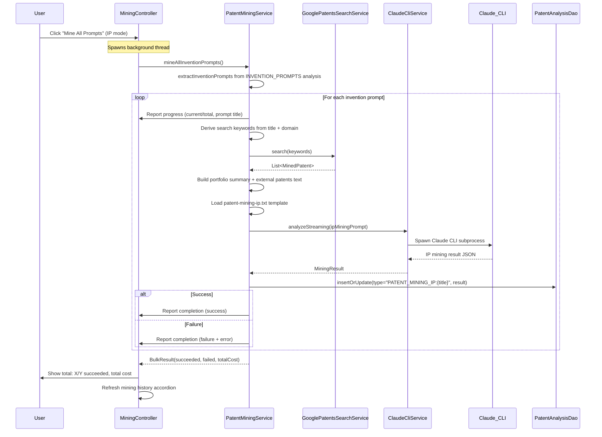

# Sequence Diagrams

This document provides detailed sequence diagrams for the major workflows in the Patent Stats application. Each diagram illustrates the interaction between UI controllers, services, data access objects, and external systems.

---

## 1. CSV Import Flow

The CSV import flow handles bulk ingestion of patent data from exported spreadsheets. It performs deduplication by file number, detects continuation/divisional parent relationships, normalizes inventor names, and produces a summary of what changed.

---

## 2. USPTO Sync Flow

The USPTO sync flow keeps local patent records up to date by querying the USPTO API for each tracked application. It detects status changes, classifies the type of movement (progression, regression, terminal, or lateral), and logs an audit trail of every change.

---

## 3. Single-Patent Analysis Flow

Single-patent analysis runs AI-powered analysis on individual patents using the Claude CLI. It extracts text from cached PDFs when needed, substitutes patent metadata into prompt templates, and stores structured JSON results along with token usage and cost tracking.

---

## 4. Cross-Patent Analysis (Chunked Map-Reduce)

Cross-patent analyses such as whitespace finding and portfolio gap analysis operate across the entire patent portfolio. When the portfolio exceeds the batch size, it is split into chunks and processed in a map-reduce pattern: each chunk is analyzed independently, then chunk results are merged hierarchically in groups of three until a single consolidated result remains.

---

## 5. General Area Patent Mining

General area mining searches external patent databases to understand the competitive landscape around a technology area. It queries Google Patents for prior art, combines external findings with the user's own portfolio summary, and uses Claude to produce a landscape analysis including patent ideas and defensive filing opportunities.

---

## 6. Bulk IP Mining

Bulk IP mining automates the patent mining workflow across all invention prompts previously generated by the invention prompt analysis. For each prompt, it derives search keywords, queries Google Patents, and runs a specialized IP mining analysis. This enables rapid coverage of the full invention space with cost tracking and progress reporting.

